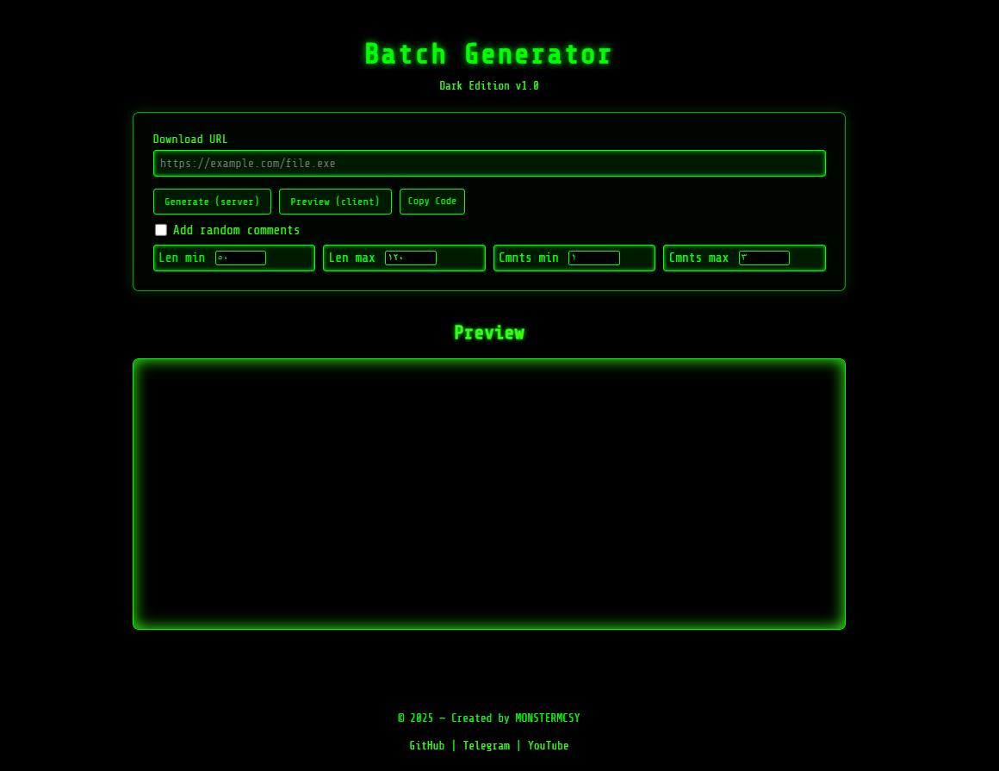
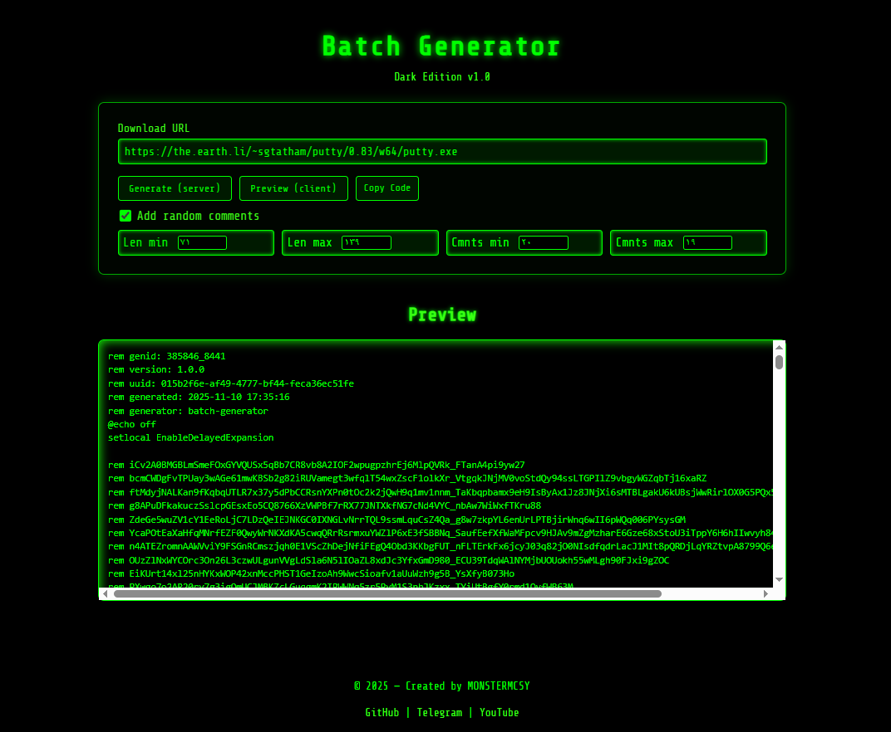

# Dark Batch Generator

**Dark Batch Generator** is a compact web tool for generating customized Batch (`.bat`) scripts. It features a stylish dark "Matrix" themed UI, client-side previewing, and optional server-side generation for downloading ready-made `.bat` files.

---

## Features

- Dark, responsive UI with a Matrix-style intro animation.
- Client-side preview: generate and inspect the final `.bat` content in your browser.
- Server-side generation: submit parameters to `generate.php` to receive a downloadable `.bat` file.
- Optionally insert randomized `REM` comment lines to obfuscate or decorate the script.
- Auto-generated meta headers (UUID, generation timestamp, version, generator ID).
- Copy-to-clipboard and toast notifications with sound.
- Mobile-friendly responsive layout.

---

## Project Structure

```
project/
│
├── index.html          # Main UI + client-side JavaScript logic
├── style.css           # Styling and Matrix animation
├── generate.php        # Server-side generator (accepts POST, returns .bat)
├── template.bat        # Batch template used for substitutions
└── README_en.md        # This file (English)
```

---

## How it Works

1. **Client-side Preview**
   - `index.html` loads `template.bat` and performs replacements (for example, replacing `%DOWNLOAD_URL%` with the user-provided URL).
   - JavaScript inserts generated metadata (UUID, gen ID, timestamp) and optionally adds random `REM` comment lines based on user settings.
   - The final script is displayed in the Preview box for inspection.

2. **Server-side Generation**
   - Clicking **Generate (server)** submits a POST to `generate.php` with the chosen options.
   - `generate.php` should perform the same template loading and replacement on the server, then emit the generated `.bat` as a downloadable file with appropriate headers.

3. **Randomization & Obfuscation**
   - When enabled, random `REM` lines are inserted after some template lines. Length, count, and frequency can be configured in the UI.

---

## Usage

1. Place the project files on a web server (or run locally).
2. Open `index.html` in a browser.
3. Enter the **Download URL** that the generated batch file should use.
4. Toggle **Add random comments** if you want obfuscation lines.
5. Click:
   - **Preview (client)** to view the generated script in the browser (no server required).
   - **Generate (server)** to POST the parameters to `generate.php` and download a `.bat` file generated by the server.
6. Use **Copy Code** to copy the previewed script to clipboard.

---

## Server Setup (for Generate button)

To enable server-side generation:

- Run a PHP-enabled web server (XAMPP, Laragon, WAMP, or a production server).
- Put all project files in a web-accessible folder (e.g., `htdocs/batch-generator/`).
- Ensure `generate.php` is writable/executable and can read `template.bat`.
- Access the UI via `http://localhost/batch-generator/index.html`.

`generate.php` should accept POST parameters such as:
- `url` — the download URL.
- `comments` — optional flag (1) to enable comments.
- `min_len`, `max_len`, `min_count`, `max_count` — comment generation settings.

The script should return a `Content-Type: application/octet-stream` (or `text/plain`) response with `Content-Disposition: attachment; filename="generated.bat"`.

---

## Customization Options

- **Template variables**: edit `template.bat` to include placeholders like `%DOWNLOAD_URL%`, `%FILE%`, or other named tokens. The client script replaces `%DOWNLOAD_URL%`.
- **Randomization**: adjust min/max lengths and counts to control the amount of inserted `REM` comments.
- **Metadata**: you can change the header format or include additional fields (author, project, tags).

---

## Security & Legal Notice

- Generated batch files can execute arbitrary commands. Do **not** run scripts from untrusted sources.
- Use this tool only for lawful purposes (testing in controlled environments, educational use, automation in systems you own or have permission to modify).
- The author disclaims responsibility for misuse.

---

## Technologies Used

- HTML5
- CSS3 (including Google Fonts)
- Vanilla JavaScript
- PHP (for server-side generation)
- Batch scripting (`.bat`)

---

## License

© 2025 — MONSTERMCSY

This project is provided for educational and development purposes. You may modify and redistribute it, but keep attribution to the original author.

---

## Author / Contact

- Project: Dark Batch Generator
- Author: MONSTERMCSY
- Footer links in the UI point to:
  - GitHub: `https://github.com/noradlb1`
  - Telegram: `https://t.me/MONSTERMCSY2`
  - YouTube: `https://www.youtube.com/@monstermc12/videos`

---

If you want, I can also:
- Embed a sample `template.bat` excerpt in this README.
- Add screenshot placeholders and an example generated output block.
- Produce a ZIP with all files ready to deploy.

Pick one and I'll do it before I lose patience.

## Images



-- --


